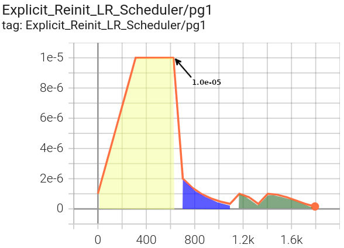

#############################
LR Scheduler Reinitialization
#############################

Overview
********
In some contexts it can be useful to re-wrap your optimizer with new LR scheduler configurations at the beginning of one
or more scheduled training phases. Among others, example use cases include:

* implementing complex LR schedules along with multi-phase early-stopping
* injecting new parameter group specific rates on a scheduled basis
* programmatically exploring training behavioral dynamics with heterogenous schedulers and early-stopping

The :class:`~finetuning_scheduler.fts.FinetuningScheduler` callback supports (versions >= ``0.1.4``) LR scheduler
reinitialization in both explicit and implicit fine-tuning schedule modes (see the
:ref:`Fine-Tuning Scheduler intro<motivation>` for more on basic usage modes). As LR scheduler reinitialization is likely
to be applied most frequently in the context of explicitly defined fine-tuning schedules, we'll cover configuration in
that mode first.

.. _explicit-lr-reinitialization-schedule:

Specifying LR Scheduler Configurations For Specific Fine-Tuning Phases
**********************************************************************

When defining a fine-tuning schedule (see :ref:`the intro<specifying schedule>` for basic schedule specification), a new
lr scheduler configuration can be applied to the existing optimizer at the beginning of a given phase by specifying the
desired configuration in the ``new_lr_scheduler`` key. The ``new_lr_scheduler`` dictionary format is described in the
annotated yaml schedule below and can be explored using the
:ref:`advanced usage example<advanced-fine-tuning-lr-example>`.

When specifying an LR scheduler configuration for a given phase, the ``new_lr_scheduler`` dictionary requires at minimum
an ``lr_scheduler_init`` dictionary containing a ``class_path`` key indicating the class of the lr scheduler
(:ref:`list of supported schedulers<supported_lr_schedulers>`) to be instantiated and wrapped around your optimizer.

Any arguments you would like to pass to initialize the specified lr scheduler with should be specified in the
``init_args`` key of the ``lr_scheduler_init`` dictionary.

.. code-block:: yaml
  :linenos:
  :emphasize-lines: 11-16

    0:
      params:
      - model.classifier.bias
      - model.classifier.weight
    1:
      params:
      - model.pooler.dense.bias
      - model.pooler.dense.weight
      - model.deberta.encoder.LayerNorm.bias
      - model.deberta.encoder.LayerNorm.weight
      new_lr_scheduler:
        lr_scheduler_init:
          class_path: torch.optim.lr_scheduler.StepLR
          init_args:
            step_size: 1
            gamma: 0.7
    ...

Optionally, one can include arguments to pass to PyTorch Lightning's lr scheduler configuration
(:class:`~pytorch_lightning.utilities.types.LRSchedulerConfig`) in the ``pl_lrs_cfg`` dictionary.

.. code-block:: yaml
  :linenos:
  :emphasize-lines: 13-16

    0:
      ...
    1:
      params:
      - model.pooler.dense.bias
      ...
      new_lr_scheduler:
        lr_scheduler_init:
          class_path: torch.optim.lr_scheduler.StepLR
          init_args:
            step_size: 1
            ...
        pl_lrs_cfg:
          interval: epoch
          frequency: 1
          name: Explicit_Reinit_LR_Scheduler

If desired, one can also specify new initial learning rates to use for each of the existing parameter groups in the
optimizer being wrapped via a list in the ``init_pg_lrs`` key.

.. code-block:: yaml
  :linenos:
  :emphasize-lines: 8

    ...
    1:
      params:
      ...
      new_lr_scheduler:
        lr_scheduler_init:
          ...
        init_pg_lrs: [2.0e-06, 2.0e-06]

All lr scheduler reinitialization configurations specified in the fine-tuning schedule will have their configurations
sanity-checked prior to training initiation.

.. note::

    It is currently is up to the user to ensure the number of parameter groups listed in ``init_pg_lrs`` matches the
    number of optimizer parameter groups created in previous phases (and if using
    :external+torch:class:`~torch.optim.lr_scheduler.ReduceLROnPlateau` with a list of ``min_lr`` s, the
    current number parameter groups). This number of groups is dependent on a number of
    factors including the ``no_decay`` mapping of parameters specified in previous phases and isn't yet
    introspected/simulated in the current :class:`~finetuning_scheduler.fts.FinetuningScheduler` version.

Note that specifying LR scheduler reinitialization configurations is only supported for phases >= ``1``. This is because
for fine-tuning phase ``0``, the LR scheduler configuration will be the scheduler that you initiate your training
session with, usually via the ``configure_optimizer`` method of
:external+pl:class:`~pytorch_lightning.core.module.LightningModule`.

.. tip::

    If you want your learning rates logged on the same graph for each of the scheduler configurations defined in various
    phases, ensure that you provide the same name in the
    `lr_scheduler configuration <https://pytorch-lightning.readthedocs.io/en/stable/common/lightning_module.html>`_
    for each of the defined lr schedulers. For instance, in the
    :ref:`lr reinitialization example<advanced-fine-tuning-lr-example>`, we provide:

    .. code-block:: yaml
      :linenos:
      :emphasize-lines: 9-13

        model:
          class_path: fts_examples.fts_superglue.RteBoolqModule
          init_args:
            lr_scheduler_init:
              class_path: torch.optim.lr_scheduler.LinearLR
              init_args:
                start_factor: 0.1
                total_iters: 4
            pl_lrs_cfg:
              # use the same name for your initial lr scheduler
              # configuration and your ``new_lr_scheduler`` configs
              # if you want LearningRateMonitor to generate a single graph
              name: Explicit_Reinit_LR_Scheduler

As you can observe in the explicit mode :ref:`lr scheduler reinitialization example<advanced-fine-tuning-lr-example>`
below, lr schedulers specified in different fine-tuning phases can be of differing types.

.. code-block:: yaml
  :linenos:
  :emphasize-lines: 13-16, 30-34

    0:
      params:
      - model.classifier.bias
      - model.classifier.weight
    1:
      params:
      - model.pooler.dense.bias
      - model.pooler.dense.weight
      - model.deberta.encoder.LayerNorm.bias
      - model.deberta.encoder.LayerNorm.weight
      new_lr_scheduler:
        lr_scheduler_init:
          class_path: torch.optim.lr_scheduler.StepLR
          init_args:
            step_size: 1
            gamma: 0.7
        pl_lrs_cfg:
          interval: epoch
          frequency: 1
          name: Explicit_Reinit_LR_Scheduler
        init_pg_lrs: [2.0e-06, 2.0e-06]
    2:
      params:
      - model.deberta.encoder.rel_embeddings.weight
      - model.deberta.encoder.layer.{0,11}.(output|attention|intermediate).*
      - model.deberta.embeddings.LayerNorm.bias
      - model.deberta.embeddings.LayerNorm.weight
      new_lr_scheduler:
        lr_scheduler_init:
          class_path: torch.optim.lr_scheduler.CosineAnnealingWarmRestarts
          init_args:
            T_0: 3
            T_mult: 2
            eta_min: 1.0e-07
        pl_lrs_cfg:
          interval: epoch
          frequency: 1
          name: Explicit_Reinit_LR_Scheduler
        init_pg_lrs: [1.0e-06, 1.0e-06, 2.0e-06, 2.0e-06]

Once a new lr scheduler is re-initialized, it will continue to be used for subsequent phases unless replaced with
another lr scheduler configuration defined in a subsequent schedule phase.

.. tip::

    If you have specified an lr scheduler with an ``lr_lambdas`` attribute in any phase,
    (e.g. :external+torch:class:`~torch.optim.lr_scheduler.LambdaLR`) you can have the last configured lambda
    automatically applied to new groups in subsequent phases by setting the
    :paramref:`~finetuning_scheduler.fts.FinetuningScheduler.apply_lambdas_new_pgs` parameter to ``True``. Note this
    option will only affect phases without reinitialized lr schedulers. Phases with defined lr scheduler
    reinitialization configs will always apply the specified config, including new lambdas if provided.

.. _implicit lr reinitialization schedule:

LR Scheduler Reinitialization With Generated (Implicit Mode) Fine-Tuning Schedules
**********************************************************************************
One can also specify LR scheduler reinitialization in the context of implicit mode fine-tuning schedules. Since the
fine-tuning schedule is automatically generated, the same LR scheduler configuration will be applied at each of the
phase transitions. In implicit mode, the lr scheduler reconfiguration should be supplied to the
:paramref:`~finetuning_scheduler.fts.FinetuningScheduler.reinit_lr_cfg` parameter of
:class:`~finetuning_scheduler.fts.FinetuningScheduler`.

For example, configuring this dictionary via the :external+pl:class:`~pytorch_lightning.cli.LightningCLI`, one
could use:

.. code-block:: yaml
  :linenos:
  :emphasize-lines: 14-23

    model:
      class_path: fts_examples.fts_superglue.RteBoolqModule
      init_args:
        lr_scheduler_init:
          class_path: torch.optim.lr_scheduler.StepLR
          init_args:
            step_size: 1
        pl_lrs_cfg:
          name: Implicit_Reinit_LR_Scheduler
    trainer:
      callbacks:
        - class_path: finetuning_scheduler.FinetuningScheduler
          init_args:
            reinit_lr_cfg:
              lr_scheduler_init:
                class_path: torch.optim.lr_scheduler.StepLR
                init_args:
                  step_size: 1
                  gamma: 0.7
              pl_lrs_cfg:
                interval: epoch
                frequency: 1
                name: Implicit_Reinit_LR_Scheduler

Note that an initial lr scheduler configuration should also still be provided per usual (again, typically via the
``configure_optimizer`` method of :external+pl:class:`~pytorch_lightning.core.module.LightningModule`) and the initial
lr scheduler configuration can differ in lr scheduler type and configuration from the configuration specified in
:paramref:`~finetuning_scheduler.fts.FinetuningScheduler.reinit_lr_cfg` applied at each phase transition. Because the
same schedule is applied at each phase transition, the ``init_pg_lrs`` list is not supported in an implicit fine-tuning
context.

Application of LR scheduler reinitialization in both explicit and implicit modes may be best understood via examples, so
we'll proceed to those next.

.. _advanced-fine-tuning-lr-example:

Advanced Usage Examples: Explicit and Implicit Mode LR Scheduler Reinitialization
*********************************************************************************
Demonstration LR scheduler reinitialization configurations for both explicit and implicit fine-tuning scheduling contexts
are available under ``./fts_examples/config/advanced/reinit_lr``.

The LR scheduler reinitialization examples use the same code and have the same dependencies as the basic
:ref:`scheduled fine-tuning for SuperGLUE<scheduled-fine-tuning-superglue>` examples except PyTorch >= ``1.10`` is
required for the explicit mode example (only because :external+torch:class:`~torch.optim.lr_scheduler.LinearLR` was
introduced in ``1.10`` and is used in the demo).

The two different demo schedule configurations are composed with shared defaults (``./config/fts_defaults.yaml``).

.. code-block:: bash

    cd ./fts_examples/
    # Demo LR scheduler reinitialization with an explicitly defined fine-tuning schedule:
    python fts_superglue.py fit --config config/advanced/reinit_lr/fts_explicit_reinit_lr.yaml

    # Demo LR scheduler reinitialization with an implicitly defined fine-tuning schedule:
    python fts_superglue.py fit --config config/advanced/reinit_lr/fts_implicit_reinit_lr.yaml

Notice in the explicitly defined schedule scenario, we are using three distinct lr schedulers for three different
training phases:

   LR log for parameter group 1 (:external+torch:class:`~torch.optim.lr_scheduler.LinearLR` initial target lr
   = ``1.0e-05``)

Phase ``0`` in :yellow-highlight:`yellow` (passed to our
:external+pl:class:`~pytorch_lightning.core.module.LightningModule` via the ``model``
definition in our :external+pl:class:`~pytorch_lightning.cli.LightningCLI` configuration) uses a
:external+torch:class:`~torch.optim.lr_scheduler.LinearLR` scheduler (defined in
``./config/advanced/reinit_lr/fts_explicit_reinit_lr.yaml``) with the initial lr defined via the shared initial optimizer
configuration (defined in ``./config/fts_defaults.yaml``).

This is the effective phase ``0`` config (defined in ``./config/advanced/reinit_lr/fts_explicit_reinit_lr.yaml``, applying
defaults defined in ``./config/fts_defaults.yaml``):

.. code-block:: yaml
  :linenos:

    model:
      class_path: fts_examples.fts_superglue.RteBoolqModule
      init_args:
        optimizer_init:
          class_path: torch.optim.AdamW
          init_args:
            weight_decay: 1.0e-05
            eps: 1.0e-07
            lr: 1.0e-05
        ...
        lr_scheduler_init:
          class_path: torch.optim.lr_scheduler.LinearLR
          init_args:
            start_factor: 0.1
            total_iters: 4
        pl_lrs_cfg:
          interval: epoch
          frequency: 1
          name: Explicit_Reinit_LR_Scheduler

Phase ``1`` in :blue-highlight:`blue` uses a :external+torch:class:`~torch.optim.lr_scheduler.StepLR` scheduler, including the specified
initial lr for the existing parameter groups (``2.0e-06``).

.. list-table:: LR log for parameter groups 1 and 3 respectively
   :widths: 50 50
   :header-rows: 1

   * - pg1 starts at ``2.0e-06``
     - pg3 starts at the default of ``1.0e-05``
   *  -
       .. figure:: ../_static/images/fts/explicit_lr_scheduler_reinit_pg1_phase1.png
          :alt: Explicit pg1
      -
       .. figure:: ../_static/images/fts/explicit_lr_scheduler_reinit_pg3_phase1.png
          :alt: Explicit pg3

This is the phase ``1`` config (defined in our explicit schedule ``./config/advanced/reinit_lr/explicit_reinit_lr.yaml``):

.. code-block:: yaml
  :linenos:

    ...
    1:
      params:
      - model.pooler.dense.bias
      - model.pooler.dense.weight
      - model.deberta.encoder.LayerNorm.bias
      - model.deberta.encoder.LayerNorm.weight
      new_lr_scheduler:
        lr_scheduler_init:
          class_path: torch.optim.lr_scheduler.StepLR
          init_args:
            step_size: 1
            gamma: 0.7
        pl_lrs_cfg:
          interval: epoch
          frequency: 1
          name: Explicit_Reinit_LR_Scheduler
        init_pg_lrs: [2.0e-06, 2.0e-06]

Phase ``2`` in :green-highlight:`green` uses a :external+torch:class:`~torch.optim.lr_scheduler.CosineAnnealingWarmRestarts` scheduler, with
the assigned initial lr for each of the parameter groups (``1.0e-06`` for pg1 and ``2.0e-06`` for pg3).

.. list-table:: LR log for parameter groups 1 and 3 respectively
   :widths: 50 50
   :header-rows: 1

   * - pg1 oscillates between ``1.0e-06`` and ``1.0e-07``
     - pg3 oscillates between ``2.0e-06`` and ``1.0e-07``
   *  -
       .. figure:: ../_static/images/fts/explicit_lr_scheduler_reinit_pg1_phase2.png
          :alt: Explicit pg1
      -
       .. figure:: ../_static/images/fts/explicit_lr_scheduler_reinit_pg3_phase2.png
          :alt: Explicit pg3

This is the phase ``2`` config (like all non-zero phases, defined in our explicit schedule
``./config/advanced/reinit_lr/explicit_reinit_lr.yaml``):

.. code-block:: yaml
  :linenos:

    ...
    2:
      params:
      - model.deberta.encoder.rel_embeddings.weight
      - model.deberta.encoder.layer.{0,11}.(output|attention|intermediate).*
      - model.deberta.embeddings.LayerNorm.bias
      - model.deberta.embeddings.LayerNorm.weight
      new_lr_scheduler:
        lr_scheduler_init:
          class_path: torch.optim.lr_scheduler.CosineAnnealingWarmRestarts
          init_args:
            T_0: 3
            T_mult: 2
            eta_min: 1.0e-07
        pl_lrs_cfg:
          interval: epoch
          frequency: 1
          name: Explicit_Reinit_LR_Scheduler
        init_pg_lrs: [1.0e-06, 1.0e-06, 2.0e-06, 2.0e-06]

In the implicitly defined schedule scenario, the :external+torch:class:`~torch.optim.lr_scheduler.StepLR` lr scheduler
specified via :paramref:`~finetuning_scheduler.fts.FinetuningScheduler.reinit_lr_cfg` (which happens to be the same as
the initially defined lr scheduler in this case) is reinitialized at each phase transition and applied to all optimizer
parameter groups.

.. code-block:: yaml
  :linenos:

    ...
    - class_path: finetuning_scheduler.FinetuningScheduler
      init_args:
        # note, we're not going to see great performance due
        # to the shallow depth, just demonstrating the lr scheduler
        # reinitialization behavior in implicit mode
        max_depth: 4
        # disable restore_best for lr pattern clarity
        restore_best: false
        reinit_lr_cfg:
          lr_scheduler_init:
            class_path: torch.optim.lr_scheduler.StepLR
            init_args:
              step_size: 1
              gamma: 0.7
          pl_lrs_cfg:
            interval: epoch
            frequency: 1
            name: Implicit_Reinit_LR_Scheduler

.. list-table:: LR log for parameter groups 1 and 3 respectively
   :widths: 50 50
   :header-rows: 0

   *  -
       .. figure:: ../_static/images/fts/implicit_lr_scheduler_reinit_pg1.png
          :alt: Explicit pg1
      -
       .. figure:: ../_static/images/fts/implicit_lr_scheduler_reinit_pg3.png
          :alt: Explicit pg3

Note that we have disabled :paramref:`~finetuning_scheduler.fts.FinetuningScheduler.restore_best` in both examples for
clarity of lr patterns.

.. note:: LR reinitialization with :class:`~finetuning_scheduler.fts.FinetuningScheduler` is currently in beta.
