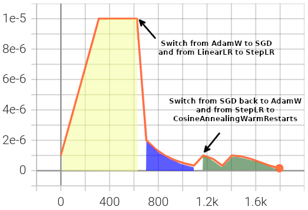
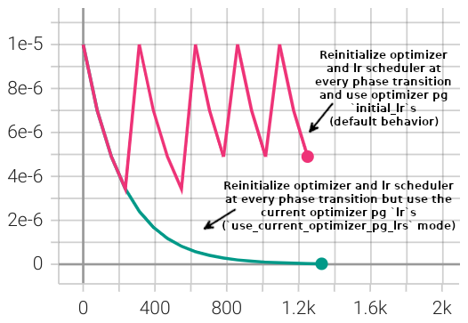

##########################
Optimizer Reinitialization
##########################

.. _optim-reinit-overview:

Overview
********
:class:`~finetuning_scheduler.fts.FinetuningScheduler` (FTS) supports the initialization of new optimizers according to
a user-specified fine-tuning schedule. Similarly motivated to Fine-Tuning Scheduler's
:ref:`lr scheduler reinitialization feature<lrs-reinit-overview>`, one can initialize new optimizers (or reinitialize
an existing one) at the beginning of one or more scheduled training phases.

Optimizer reinitialization is supported:

- In both explicit and implicit fine-tuning schedule modes (see the :ref:`Fine-Tuning Scheduler intro<motivation>` for
  more on basic usage modes)
- With or without concurrent lr scheduler reinitialization
- In the context of all supported training strategies (including FSDP)
- With FTS >= ``2.0.2``

We'll cover both implicit and explicit configuration modes below and provide a slightly altered version of the
:ref:`lr scheduler reinitialization example<advanced-fine-tuning-lr-example>` that demonstrates concurrent
reinitialization of optimizers and lr schedulers at different phases.

.. _explicit-optimizer-reinitialization-schedule:

Specifying Optimizer Configurations For Specific Fine-Tuning Phases
*******************************************************************

When defining a fine-tuning schedule (see :ref:`the intro<specifying schedule>` for basic schedule specification), a new
optimizer configuration can be applied to the existing training session at the beginning of a given phase by specifying
the desired configuration in the ``new_optimizer`` key. The ``new_optimizer`` dictionary format is described in the
annotated yaml schedule below and can be explored using the :ref:`advanced usage example<advanced-fine-tuning-optimizer-example>`.

When specifying an optimizer configuration for a given phase, the ``new_optimizer`` dictionary requires at minimum
an ``optimizer_init`` dictionary containing a ``class_path`` key indicating the class of the optimizer
(:ref:`list of supported optimizers<supported_reinit_optimizers>`) to be instantiated.

Any arguments with which you would like to initialize the specified optimizer should be specified in the
``init_args`` key of the ``optimizer_init`` dictionary.

.. code-block:: yaml
  :linenos:
  :emphasize-lines: 11-17

    0:
      params:
      - model.classifier.bias
      - model.classifier.weight
    1:
      params:
      - model.pooler.dense.bias
      - model.pooler.dense.weight
      - model.deberta.encoder.LayerNorm.bias
      - model.deberta.encoder.LayerNorm.weight
      new_optimizer:
        optimizer_init:
          class_path: torch.optim.SGD
          init_args:
            lr: 2.0e-03
            momentum: 0.9
            weight_decay: 2.0e-06
    ...

Optionally, one can also provide an lr scheduler reinitialization directive in the same phase as an optimizer
reinitialization directive. If one does not provide a ``new_lr_scheduler`` directive, the latest lr state will still be
restored and wrapped around the new optimizer prior to the execution of the new phase (as with lr scheduler
reinitialization):

.. code-block:: yaml
  :linenos:
  :emphasize-lines: 14-21

    0:
      ...
    1:
      params:
      - model.pooler.dense.bias
      ...
      new_optimizer:
        optimizer_init:
          class_path: torch.optim.SGD
          init_args:
            lr: 2.0e-03
            momentum: 0.9
            weight_decay: 2.0e-06
      new_lr_scheduler:
        lr_scheduler_init:
          class_path: torch.optim.lr_scheduler.StepLR
          init_args:
            ...
        pl_lrs_cfg:
            ...
        init_pg_lrs: [2.0e-06, 2.0e-06]

All optimizer reinitialization configurations specified in the fine-tuning schedule will have their configurations
sanity-checked prior to training initiation.

.. _optimizer-compat-note:

.. note::

    When reinitializing optimizers, FTS does not fully simulate/evaluate all compatibility scenarios so it is the user's
    responsibility to ensure compatibility between optimizer instantiations or to set
    :paramref:`~finetuning_scheduler.fts.FinetuningScheduler.restore_best`  to ``False``. For example consider the
    following training scenario:

    .. code-block::

      Phase 0: SGD training
      Phase 1: Reinitialize the optimizer and continue training with an Adam optimizer
      Phase 2: Restore best checkpoint from phase 0 (w/ `restore_best` default of `True`)

    Phase ``2`` would fail due to incompatibility between Adam and SGD optimizer states. This issue could be avoided by
    either reinitializing the Adam optimizer again in phase ``2`` or setting
    :paramref:`~finetuning_scheduler.fts.FinetuningScheduler.restore_best`` to ``False``. [#]_

Both lr scheduler and optimizer reinitialization configurations are only supported for phases >= ``1``. This is because
for fine-tuning phase ``0``, training component configurations will be the ones the user initiated the training
session with, usually via the ``configure_optimizer`` method of
:py:class:`~lightning.pytorch.core.module.LightningModule`.

As you can observe in the explicit mode :ref:`optimizer reinitialization example<advanced-fine-tuning-optimizer-example>`
below, optimizers specified in different fine-tuning phases can be of differing types.

.. code-block:: yaml
  :linenos:
  :emphasize-lines: 13, 27

    0:
      params:
      - model.classifier.bias
      - model.classifier.weight
    1:
      params:
      - model.pooler.dense.bias
      - model.pooler.dense.weight
      - model.deberta.encoder.LayerNorm.bias
      - model.deberta.encoder.LayerNorm.weight
      new_optimizer:
        optimizer_init:
          class_path: torch.optim.SGD
          init_args:
            lr: 2.0e-03
            momentum: 0.9
            weight_decay: 2.0e-06
      ...
    2:
      params:
      - model.deberta.encoder.rel_embeddings.weight
      - model.deberta.encoder.layer.{0,11}.(output|attention|intermediate).*
      - model.deberta.embeddings.LayerNorm.bias
      - model.deberta.embeddings.LayerNorm.weight
      new_optimizer:
        optimizer_init:
          class_path: torch.optim.AdamW
          init_args:
            weight_decay: 1.0e-05
            eps: 1.0e-07
            lr: 1.0e-05
      ...

Once a new optimizer is re-initialized, it will continue to be used for subsequent phases unless replaced with
another optimizer configuration defined in a subsequent schedule phase.

.. _implicit optimizer lr scheduler reinitialization schedule:

Optimizer Reinitialization With Generated (Implicit Mode) Fine-Tuning Schedules
*******************************************************************************
One can also specify optimizer reinitialization in the context of implicit mode fine-tuning schedules. Since the
fine-tuning schedule is automatically generated, the same optimizer configuration will be applied at each of the
phase transitions. In implicit mode, the optimizer reconfiguration should be supplied to the
:paramref:`~finetuning_scheduler.fts.FinetuningScheduler.reinit_optim_cfg` parameter of
:class:`~finetuning_scheduler.fts.FinetuningScheduler`.

For example, configuring this dictionary via the :py:class:`~lightning.pytorch.cli.LightningCLI`, one
could use:

.. code-block:: yaml
  :linenos:
  :emphasize-lines: 7-13

    model:
      ...
    trainer:
      callbacks:
        - class_path: finetuning_scheduler.FinetuningScheduler
          init_args:
            reinit_optim_cfg:
              optimizer_init:
                class_path: torch.optim.AdamW
                init_args:
                  weight_decay: 1.0e-05
                  eps: 1.0e-07
                  lr: 1.0e-05
            reinit_lr_cfg:
              lr_scheduler_init:
                class_path: torch.optim.lr_scheduler.StepLR
                ...

Note that an initial optimizer configuration should also still be provided per usual (again, typically via the
``configure_optimizer`` method of :py:class:`~lightning.pytorch.core.module.LightningModule`) and the initial
optimizer configuration can differ in optimizer type and configuration from the configuration specified in
:paramref:`~finetuning_scheduler.fts.FinetuningScheduler.reinit_optim_cfg` applied at each phase transition. As with
explicit mode, concurrent :paramref:`~finetuning_scheduler.fts.FinetuningScheduler.reinit_lr_cfg` configurations can
also be specified in implicit mode.

.. _advanced-fine-tuning-optimizer-example:

Advanced Usage Examples: Explicit and Implicit Mode Concurrent Optimizer and LR Scheduler Reinitialization
**********************************************************************************************************
Demonstration optimizer and concurrent lr scheduler reinitialization configurations for both explicit and
fine-tuning scheduling contexts are available under ``./fts_examples/config/advanced/reinit_optim_lr``.

The concurrent optimizer and lr scheduler reinitialization examples use the same code and have the same dependencies as
the lr scheduler reinitialization-only (with the exception of requiring FTS >= ``2.0.2`` )
:ref:`examples<advanced-fine-tuning-lr-example>`.

The two different demo schedule configurations are composed with shared defaults (``./config/fts_defaults.yaml``).

.. code-block:: bash

    # Demo concurrent optimizer and lr scheduler reinitializations...
    cd ./fts_examples

    # with an explicitly defined fine-tuning schedule:
    python fts_superglue.py fit --config config/advanced/reinit_optim_lr/fts_explicit_reinit_optim_lr.yaml

    # with an implicitly defined fine-tuning schedule:
    python fts_superglue.py fit --config config/advanced/reinit_optim_lr/fts_implicit_reinit_optim_lr.yaml

    # with non-default `use_current_optimizer_pg_lrs` mode (and an implicit schedule):
    python fts_superglue.py fit --config config/advanced/reinit_optim_lr/fts_implicit_reinit_optim_lr_use_curr.yaml

Similar to the explicitly defined lr reinitialization-only schedule example, we are using three distinct lr schedulers
for three different training phases. In this case, there are also distinctly configured optimizers being used:

.. _explicit-config-overview:

* The :ref:`configured phase 0<explicit-phase-0-config>` in :yellow-highlight:`yellow` uses an :py:class:`~torch.optim.AdamW` optimizer and :py:class:`~torch.optim.lr_scheduler.LinearLR` scheduler with the initial lr and optimizer defined via the shared initial optimizer configuration.
* The :ref:`configured phase 1<explicit-phase-1-config>` in :blue-highlight:`blue` uses a :py:class:`~torch.optim.SGD` optimizer and :py:class:`~torch.optim.lr_scheduler.StepLR` scheduler, including the specified initial lr for the existing parameter groups (``2.0e-06``).
* The :ref:`configured phase 2<explicit-phase-2-config>` in :green-highlight:`green` switches back to an :py:class:`~torch.optim.AdamW` optimizer but uses a :py:class:`~torch.optim.lr_scheduler.CosineAnnealingWarmRestarts` scheduler, with an assigned initial lr for each of the parameter groups.

Because we turned on DEBUG-level logging to trace reinitializations, we observe the following in our training log upon
the phase ``1`` optimizer reinitialization:

.. code-block::
  :linenos:
  :emphasize-lines: 4, 6

  Epoch 8: 100%|██████████| 78/78 ...
  ...
  Fine-Tuning Scheduler has reinitialized the optimizer as directed:
  Previous optimizer state: AdamW
  ... (followed by parameter group config details)
  New optimizer state: SGD
  ... (followed by parameter group initial config details, note existing lr state or user directives may subsequently override the `lr`s in this initial config)

In the implicitly defined schedule scenario, we begin using the :py:class:`~torch.optim.AdamW` optimizer
but the :py:class:`~torch.optim.SGD` optimizer and :py:class:`~torch.optim.lr_scheduler.StepLR`
lr scheduler are specified via :paramref:`~finetuning_scheduler.fts.FinetuningScheduler.reinit_optim_cfg` and
:paramref:`~finetuning_scheduler.fts.FinetuningScheduler.reinit_lr_cfg` respectively. Both training components are
reinitialized at each phase transition and applied to all optimizer parameter groups.

.. code-block:: yaml
  :linenos:
  :emphasize-lines: 28

    ...
    - class_path: finetuning_scheduler.FinetuningScheduler
      init_args:
        # note, we're not going to see great performance due
        # to the shallow depth, just demonstrating the lr scheduler
        # reinitialization behavior in implicit mode
        max_depth: 4
        restore_best: false  # disable restore_best for lr pattern clarity
        logging_level: 10  # enable DEBUG logging to trace all reinitializations
        reinit_optim_cfg:
          optimizer_init:
            class_path: torch.optim.SGD
            init_args:
              lr: 1.0e-05
              momentum: 0.9
              weight_decay: 1.0e-06
        reinit_lr_cfg:
          lr_scheduler_init:
            class_path: torch.optim.lr_scheduler.StepLR
            init_args:
              step_size: 1
              gamma: 0.7
          pl_lrs_cfg:
            interval: epoch
            frequency: 1
            name: Implicit_Reinit_LR_Scheduler
          # non-default behavior set in `fts_implicit_reinit_optim_lr_use_curr.yaml`
          use_current_optimizer_pg_lrs: true

.. _use-curr-optim-pg-example:

   LR log for parameter group 1 reflecting repeated reinitialization of the :py:class:`~torch.optim.SGD` optimizer and :py:class:`~torch.optim.lr_scheduler.StepLR` lr scheduler (initial target lr = ``1.0e-05``) at each phase transition.
   The behavioral impact of ``use_current_optimizer_pg_lrs`` (line 28 above) on the lr scheduler reinitializations can be clearly observed.

Note that we have disabled :paramref:`~finetuning_scheduler.fts.FinetuningScheduler.restore_best` in both examples for
clarity of lr patterns.

.. note:: Optimizer reinitialization with :class:`~finetuning_scheduler.fts.FinetuningScheduler` is currently in beta.

Configuration Appendix
**********************

.. _explicit-phase-0-config:

Effective phase ``0`` config defined in ``./config/advanced/reinit_optim_lr/fts_explicit_reinit_optim_lr.yaml``, applying defaults defined in ``./config/fts_defaults.yaml`` :ref:`⏎<explicit-config-overview>`

.. code-block:: yaml
  :linenos:

  ...
  model:
    class_path: fts_examples.fts_superglue.RteBoolqModule
    init_args:
      optimizer_init:
        class_path: torch.optim.AdamW
        init_args:
          weight_decay: 1.0e-05
          eps: 1.0e-07
          lr: 1.0e-05
      ...
      lr_scheduler_init:
        class_path: torch.optim.lr_scheduler.LinearLR
        init_args:
          start_factor: 0.1
          total_iters: 4
      pl_lrs_cfg:
        interval: epoch
        frequency: 1
        name: Explicit_Reinit_LR_Scheduler

.. _explicit-phase-1-config:

Phase ``1`` config, defined in our explicit schedule ``./config/advanced/reinit_optim_lr/explicit_reinit_optim_lr.yaml`` :ref:`⏎<explicit-config-overview>`

.. code-block:: yaml
  :linenos:

  ...
  1:
    params:
    - model.pooler.dense.bias
    - model.pooler.dense.weight
    - model.deberta.encoder.LayerNorm.bias
    - model.deberta.encoder.LayerNorm.weight
    new_optimizer:
      optimizer_init:
        class_path: torch.optim.SGD
        init_args:
          lr: 1.0e-05
          momentum: 0.9
          weight_decay: 1.0e-06
    new_lr_scheduler:
      lr_scheduler_init:
        class_path: torch.optim.lr_scheduler.StepLR
        init_args:
          step_size: 1
          gamma: 0.7
      pl_lrs_cfg:
        interval: epoch
        frequency: 1
        name: Explicit_Reinit_LR_Scheduler
      init_pg_lrs: [2.0e-06, 2.0e-06]

.. _explicit-phase-2-config:

Phase ``2`` config, like all non-zero phases, defined in our explicit schedule ``./config/advanced/reinit_optim_lr/explicit_reinit_optim_lr.yaml`` :ref:`⏎<explicit-config-overview>`

.. code-block:: yaml
  :linenos:

  ...
  2:
    params:
    - model.deberta.encoder.rel_embeddings.weight
    - model.deberta.encoder.layer.{0,11}.(output|attention|intermediate).*
    - model.deberta.embeddings.LayerNorm.bias
    - model.deberta.embeddings.LayerNorm.weight
    new_optimizer:
      optimizer_init:
        class_path: torch.optim.AdamW
        init_args:
          weight_decay: 1.0e-05
          eps: 1.0e-07
          lr: 1.0e-05
    new_lr_scheduler:
      lr_scheduler_init:
        class_path: torch.optim.lr_scheduler.CosineAnnealingWarmRestarts
        init_args:
          T_0: 3
          T_mult: 2
          eta_min: 1.0e-07
      pl_lrs_cfg:
        interval: epoch
        frequency: 1
        name: Explicit_Reinit_LR_Scheduler
      init_pg_lrs: [1.0e-06, 1.0e-06, 2.0e-06, 2.0e-06]

Footnotes
*********

.. [#] While FTS could theoretically cache optimizer state prior to checkpoint restoration for potentially incompatible
 optimizer reinitialization configurations, that functionality is not currently implemented because of the resource
 overhead and unnecessary complexity it would add to the default restoration path. If there is sufficient interest
 in the user community, that functionality may be added in the future. :ref:`⏎<optimizer-compat-note>`
