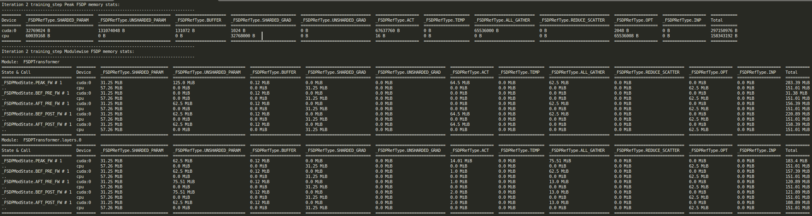
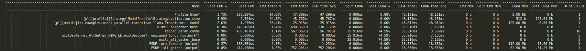

#################
Profiling Example
#################

.. _model-parallel-configurable-profiling:

Profiling Composable Distributed Training
*****************************************

Composable distributed training (especially at scale) can make profiling resource utilization both more important and
challenging. To address this need, FTS includes a utility that enables quick, flexible orchestration of advanced
profiling combining multiple complementary PyTorch profilers.

The :class:`~fts_examples.profiling.memprofiler.MemProfiler` is a utility that expedites simultaneous configuration and
orchestration of numerous complementary profiling methods. As demonstrated in this example, the following profiling
utilities are integrated and simultaneously configured:

- ``FSDP2MemTracker``
- `cuda memory snapshot and allocator history tracking <https://pytorch.org/docs/stable/torch_cuda_memory.html>`_
- host-level memory tracking
- custom memory hooks (e.g. for activation checkpoint memory tracking via ``saved_tensors_hooks`` etc.)

The PyTorch Profiler (as well as an  extended version), can also be simultaneously configured to provide a remarkably
complete view of distributed training resource utilization.

.. note::

    While this example focuses on composable distributed training,
    :class:`~fts_examples.profiling.memprofiler.MemProfiler` can be used with any type of training session.

Profiling Artifacts
*******************

This example uses the following simple profiling configuration to enable extensive profiling of the default method
('training_step') using a default schedule (warmup 1 iteration, collect for 1 iteration) and produces the profiling
artifacts below.

For this ``model_parallel`` example, all artifacts should be nested in the tensorboard log dir under ``fts_examples``/
``model_parallel`` / ``lightning_logs`` / ``fts_fsdp_profiling`` / ``version_{n}``.

1. ``FSDP2MemTracker`` tracking for the collected iteration (per-rank), e.g.:
   ``./memprofiler/fsdp_mem_rank_0_training_step_2.log``
2. Consolidated memory snapshot collection entries, dumped to ``.yaml`` by default (can also be dumped to ``*.pickle``
   if preferred).

   - Snapshot entries are provided for each profiled method, 'start' and 'end' of each iteration for each
     of the enabled memory tracking types.
   - By default, keys associated with 'cuda', 'cpu' (host-memory), and custom memory hooks are included.
   - The custom hooks are ``saved_tensors_hooks`` in this case, tracking non-parameter packed bytes which is a useful
     proxy for memory associated with activations: ``./memprofiler/rank_1_memory_stats.yaml``
3. Cuda allocator history tracking, start and end of the collected iteration (per-rank), e.g.:
   ``./memprofiler/cuda_alloc_rank_0.training_step.2.end.pickle``
4. PyTorch Profiler (extended version), according to the separately provided PyTorch Profiler configuration, e.g.:

   - ``./fit-fts_extended_pytorch_profiler-0[Strategy]ModelParallelStrategy.training_step.{epoch time}.pt.trace.json``
   - ``./fit-fts_extended_pytorch_profiler-0.txt``

Configuration
*************

.. code-block:: yaml

    trainer.profiler: pytorch_profiler.yaml  # enable normal PyTorch Profiler configuration
    # we enable MemProfiler collection for default functions ('training_step') and schedule
    # note any method decorated with @MemProfiler.memprofilable can be specified for collection
    memprofiler_cfg:
        enabled: true
        cuda_allocator_history: true  # enable cuda memory snapshot/allocator history tracking
        track_fsdp_mem: true  # enable FSDP2MemTracker tracking
        fsdp_mem_track_module_depth: 3  # collect up to 3 levels of nested FSDP modules
        fsdp_mem_tracker_tabulate: true  # display FSDP2MemTracker stats in a table
        fsdp_mem_tracker_root_module: 'model'  # the root FSDP module for FSDP2MemTracker to track

Reviewing the Results
*********************

Running the example with the following command, we can explore the detailed resource utilization characterization we now
have available!

.. code-block:: bash

    cd ./fts_examples/model_parallel && \
    python mp_examples.py fit --config config/fts_fsdp_profiling.yaml --config config/profiling/memprofiler_demo.yaml

1. ``FSDP2MemTracker`` tracking data for rank 0:

   FSDP2 Mem Tracker Report for ``training_step`` iteration 2, rank `0`

2. Consolidated cuda memory snapshot, custom hook ('npp' ``saved_tensors_hooks`` in this case) and host-level memory
   summary  (rank ``0`` in this case):

.. code-block:: yaml

    0.training_step.2.end:
        #...
        # standard cuda memory snapshot data
        active_bytes.all.allocated: 1948350976
        active_bytes.all.current: 184830976
        active_bytes.all.freed: 1763520000
        active_bytes.all.peak: 330579456
        #...
        active_bytes.small_pool.allocated: 204683776
        ...
        # measured 6.5 MiB of non-parameter packed bytes using our custom `saved_tensors_hooks``
        npp_diff: 6815744
        npp_post_forward: 6815744
        npp_pre_forward: 0
        num_ooms: 0
        #...
        # more standard cuda memory snapshot data
        reserved_bytes.all.peak: 551550976
        #...
        # host-level memory snapshot data
        rss: 2174173184
        rss_diff: 393216
        rss_post_forward: 2173976576
        rss_pre_forward: 2173583360
        #...
        vms: 19357667328
    0.training_step.2.start:
        #...
        active_bytes.all.allocated: 1281527296
        #...

3. Cuda allocator history visualization (generate by dragging the desired ``*.pickle`` file to
https://pytorch.org/memory_viz)

.. figure:: ../_static/images/fts/cuda_allocation_active_timeline.png
   :alt: Cuda Allocator History Active Timeline
   :width: 100%

   Cuda Allocator History Active Timeline for ``training_step`` iteration 2,  rank ``0``, start snapshot

4. PyTorch Profiler

.. figure:: ../_static/images/fts/pytorch_profiler_tboard.png
   :alt: PyTorch profiler tensorboard visualizations
   :width: 100%

   PyTorch profiler tensorboard visualizations

   PyTorch profiler textual summary rank ``0``
